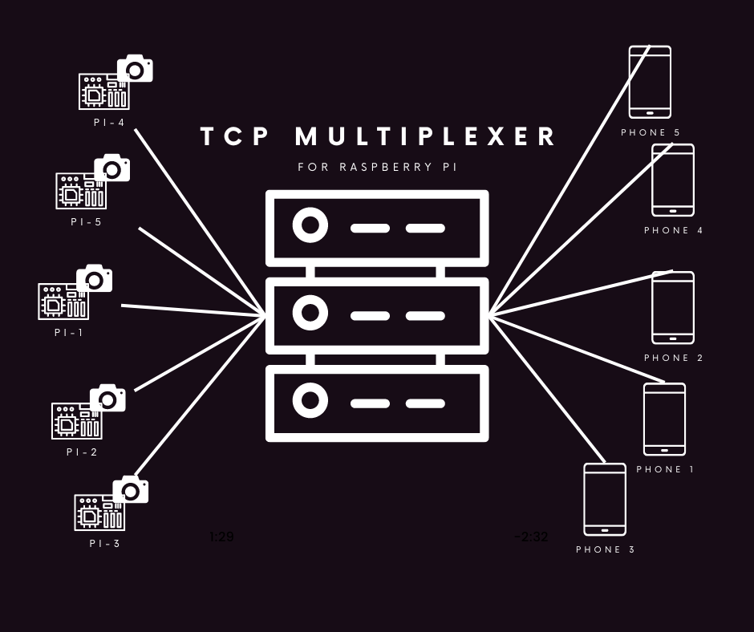

<a name="readme-top"></a>


  <a href="https://github.com/modelingevolution/TcpMultiplexer">
    
  </a>

<!-- PROJECT LOGO -->
<br />
<div align="center">

<h3 align="center">TcpMultiplexer</h3>

  <p align="center">
    Application for grabbing video frames sended by using Tcp protocol and send it further to multiple clients.  <br />You can use it with Raspberry Pi's.
        <br /> It's fully compatible with 
     <a href="https://github.com/modelingevolution/RaspPlayer"><strong>RaspPlayer</strong></a>
    <br />
    <a href="https://github.com/modelingevolution/TcpMultiplexer"><strong>Explore the docs »</strong></a>
    <br />
    <br />
    <a href="https://github.com/modelingevolution/TcpMultiplexer/issues">Report Bug</a>
 
</div>


<!-- ABOUT THE PROJECT -->
## About The Project

Application was created by [ModelingEvolution](https://modelingevolution.com) and it's open-sourced project so feel free to use it wherever you want!


Full tutorial is available [here](https://www.modelingevolution.com/rasp-player-tutorial).

## Running on Docker
You can pull our image from:
```shell
docker pull engineersme/tcpmultiplexer:latest
```

and run it:

```shell
docker run --name TcpMultiplexer -d -p 5066:80 -p 9001:9001 engineersme/tcpmultiplexer:latest -e ASPNETCORE_ENVIRONMENT="Docker" -e DOTNET_URLS="http://+:80;" -e ASPNETCORE_URLS="http://+:80;" --listen 0.0.0.0 --port 9001 --autostart
```
